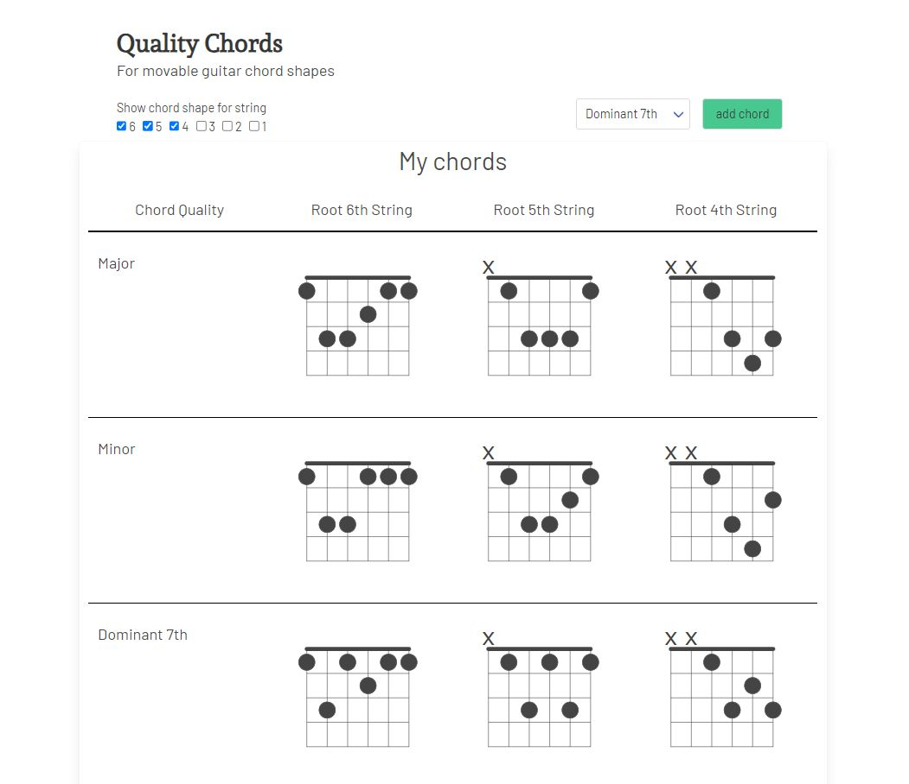
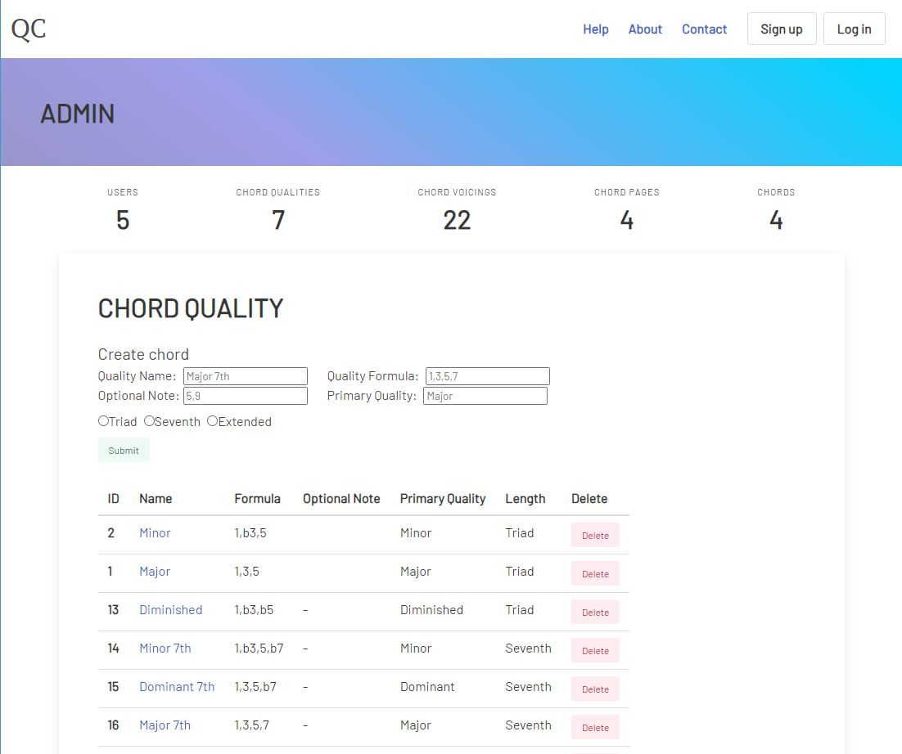
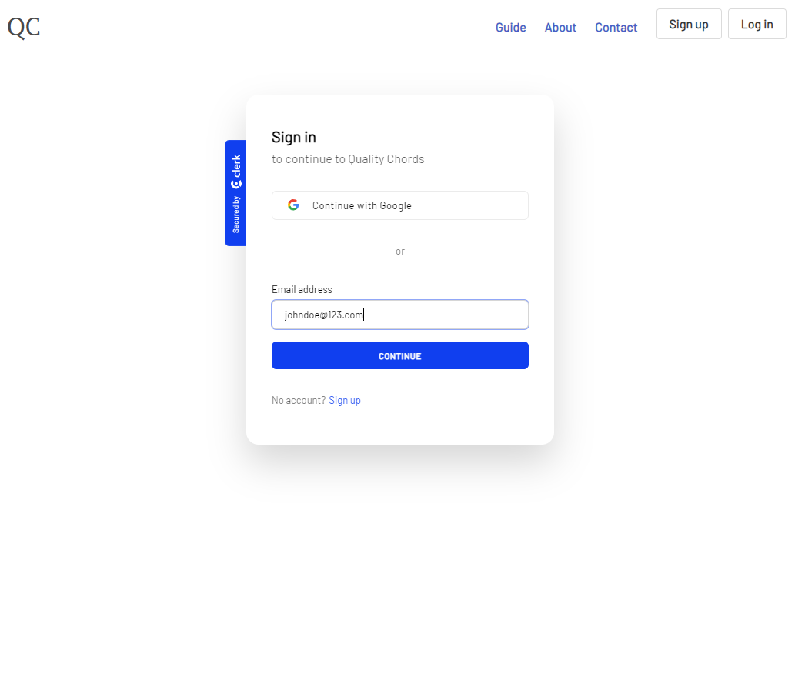
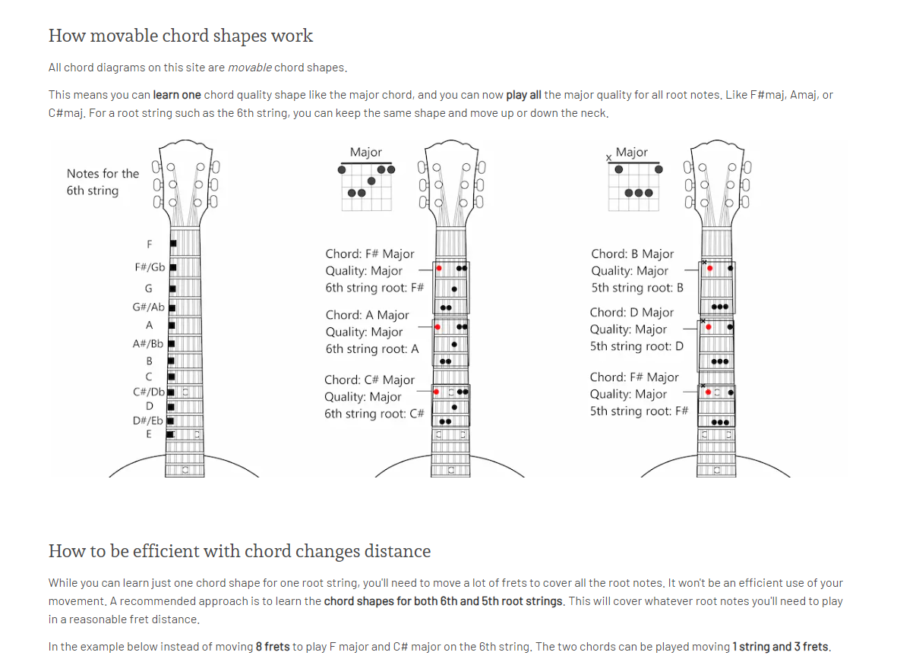

# Quality Chords

Database of guitar chord shapes by quality generated as chord diagrams.

## About

Renders guitar chord shapes by chord quality, and organized by root string. Features

- An admin console with full CRUD operations on all data
- Five database model schema for future integrations of users, pages, by note chords.
- User authentication with saved Chord Pages to user

Developer journal write up [here](https://github.com/kevin-lambda/kevin-lambda/blob/main/dev_log.md#quality-chords)

## Key Technology

- Next.js 13
- Bulma css
- @tombatossals/react-chords

## Acknowledgements

[David Rubert](https://github.com/tombatossals) react chord svg renderer library

## CHANGE LOG

_July 24 2023: version 0.1.0_

- Render svg chord diagrams by quality, toggle by root string
- Basic chord database ~20 chord voicings
- Database architecture of 5 schemas prepped for implementing users, chord pages, chord by note
- Password protected admin console with full CRUD actions over all model records
- Basic browser window print

_August 24 2023: version 0.2.0_

- User Authentication, login and signup
- Guide and about pages content
- Saved chord pages data to user
- Custom page titles saved

**ROAD MAP**  
COMPLETED:  
[x] 8/24 Supplemental pages for: Help about contact  
[x] 8/24 chord page title naming

[x] 8/24 User authentication log in, sign up  
[x] 8/24 User profile page  
[x] 8/24 Save chord page to user

FEATURES:  
[] chord diagram tones >>> forking svg chord library, manually configuring to allow tones  
[] chord diagram remove nut

[] Alternate same chord root voicing carousel  
[] add alternate same chord root voicings

[] Upgrade print functionality, only show chord page

[] dedicated signed in/out views, instead of conditional rendering >>> performance

[] Remove, reorder shown chords via drag and drop? else buttons

[] Clean up admin CRUD UX/UI and dynamic admin pages

MISC:  
[] add TS  
[] add unit tests
